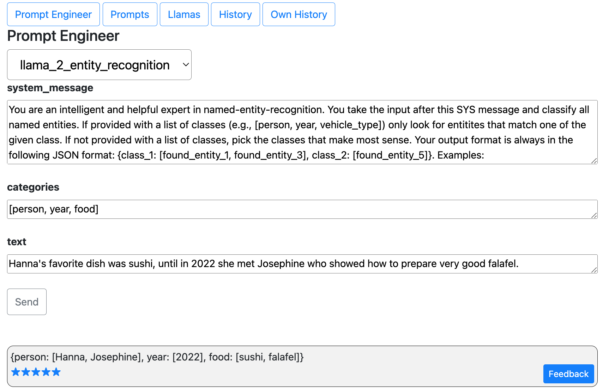
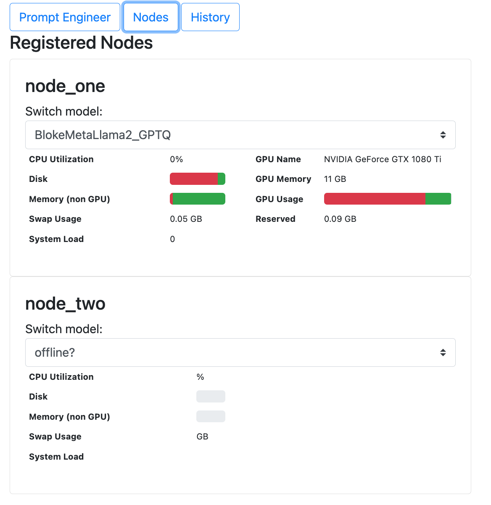
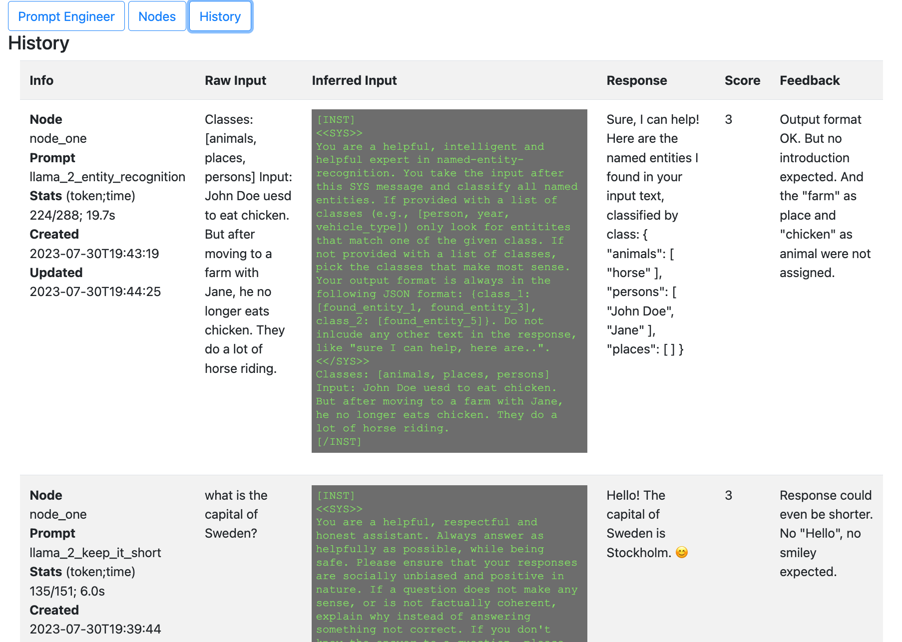
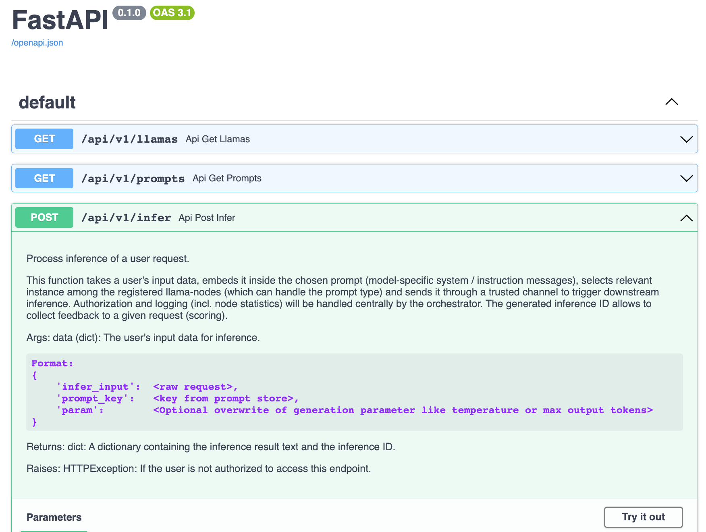

# Herding Llamas

A modern framework as scalable API backend to develop and serve diverse LLM applications across your organization.
# Introduction
## Vision
- Build your own farm of multiple **Large Language Models** *(LLM)*
- Off-the-shelf (e.g., [hf.co](https://huggingface.co/spaces/HuggingFaceH4/open_llm_leaderboard)) or fine-tuned to your needs
- Hot-swap backend models (*planned: automatic swith based on observed demand*)
- **Build and manage your repository of** model-specific **prompts** *(e.g., natural language, code understanding)* and **chains**
- Serve everything through **one single API**
- **Monitor, channel and prioritize** *(or limit)* **use** (per consuming app or user/role based)
- **Scale!**

## Motivation
With better generations of open source LLMs becoming available for personal and commercial use at the current pace, organizations and even private persons start to recognize them as an alternative or extension to products like ChatGPT and Bard. 

But it is increasingly challenging to bridge between experimentation and application, between prompt engineering and system integration. 

Developing siloed solutions for a growing portfolio of use cases will lead to missed opportunities and unnecessary cost (by re-inventing the wheel and under-utilizing resources - namely GPU time).

**Herding-Llamas** is a dynamic and versatile framework designed to serve as the core platform for innovation initiatives intending to utilize open-source LLMs. By offering a single, unified API for prompt engineering and integration into existing applications (or direclty serving a tailored web-UI around its API), Herding-Llamas significantly reduces time and complexity involved in launching a new idea or experimenting with rapidly evolving LLM generations.

With the ability to map prompts directly to your intended audience, whether this is a specific application or user group, and hand out access tokens alongside the API entry point, Herding-Llamas makes it remarkably easy to commence feedback collection.

# Features

## Prompt engineering
Admin interface to test and develop new prompts

*Coming soon: Overwrite default parameters like temperature (measure of creativity), custom stop-words etc.*

## Llama nodes 
Monitor the health of all your registered Llama nodes and dynamically switch the loaded model.

*Coming soon: Statistics of requests/tokens processed per hour, heatmap*

## Request history
See a history of recent prompts incl. statistics (user waiting time, number of tokens processed etc.).

*Coming soon: Users can opt-out on keeping a history of their prompt content.*

## API exploration
Interactive exploration, call and test your API directly from the browser

# Getting Started
*Coming soon: `pip install herding-llamas` and **Dockerfiles** for orchestrator and nodes.*
## Nodes (Llamas)
1. Clone this repository to your nodes
1. Update [conf.yml](./herding_llamas/llama/conf.yml) to your needs by adding models that should be loadable on each node. Set your custom `API_KEY` as secret between the node and the orchestrator
1. Run `./herding_llamas/llama/startup.sh` (change the `port` if needed)
## Orchestrator (Herder)
1. Clone this repository to your orchestrator
1. Add your prompts to [prompts.yml](./herding_llamas/herder/prompts.yml)
1. Register your nodes in [llamas.yml](./herding_llamas/herder/llamas.yml)
1. Run `./herding_llamas/herder/startup.sh` (change the `port` if needed)

# Roadmap
- Add user and licensing model
  - Allow-list for prompts and nodes
  - Set limits per user (number of requests/tokens per hour)
- Dynamically switch models on nodes, based on observed demand
- Queuing mechanism for requests
- Improve error handling and logging
- Allow to add modules / plugins (e.g., personal vector stores / chat with your data, reasoning, ...)

As this project is still in earl stage, the roadmap will likley be subject to frequent change.