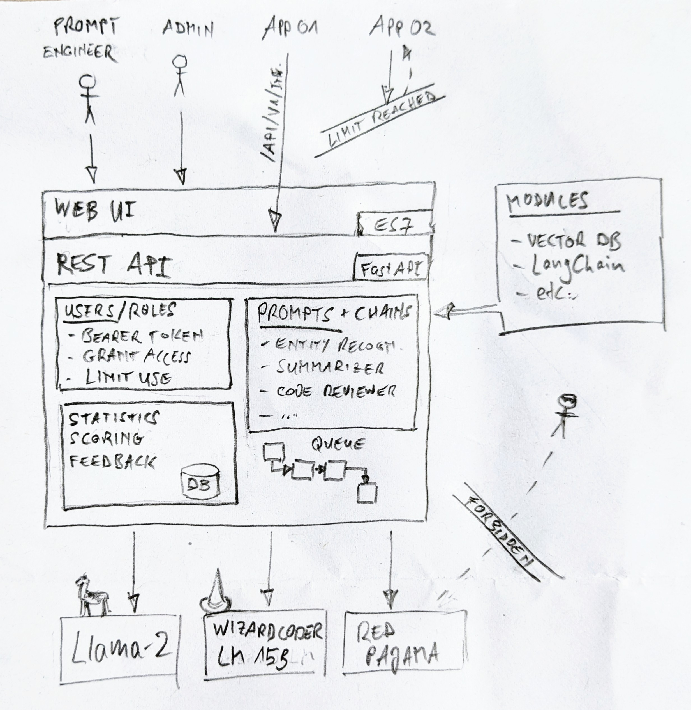
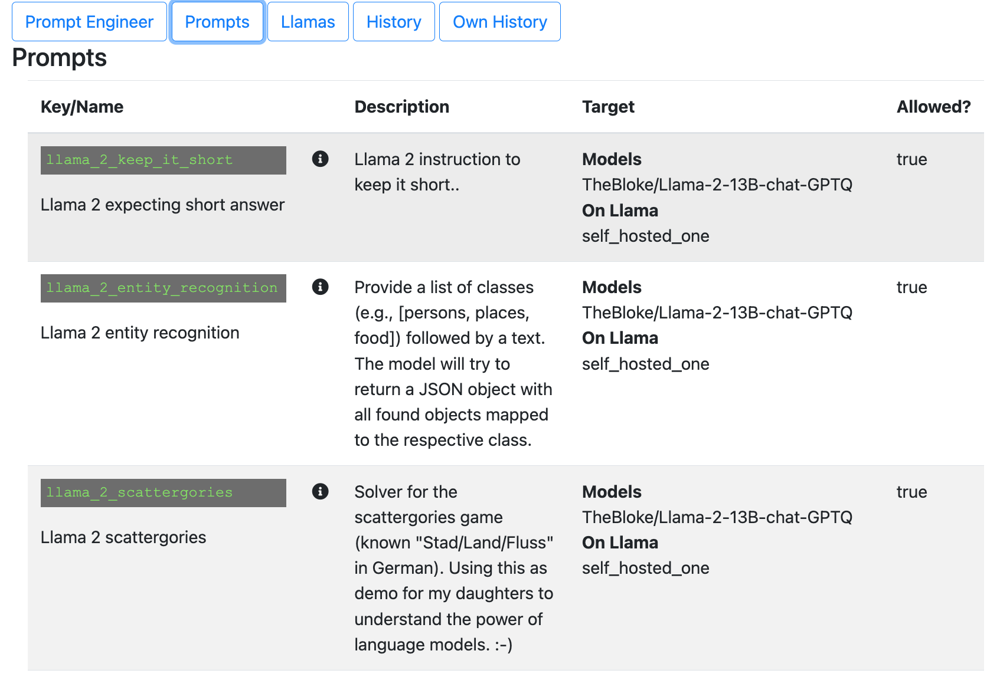
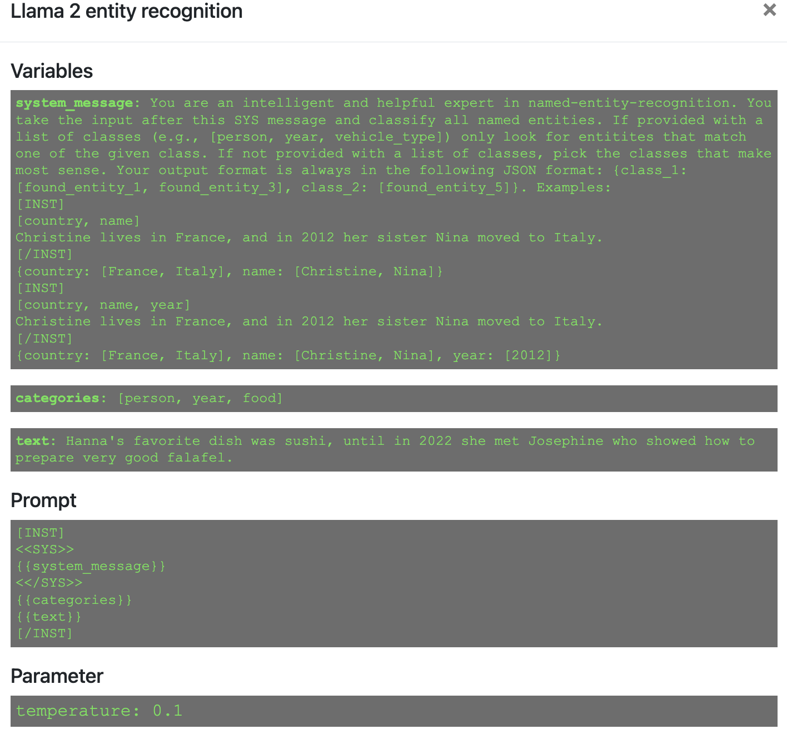
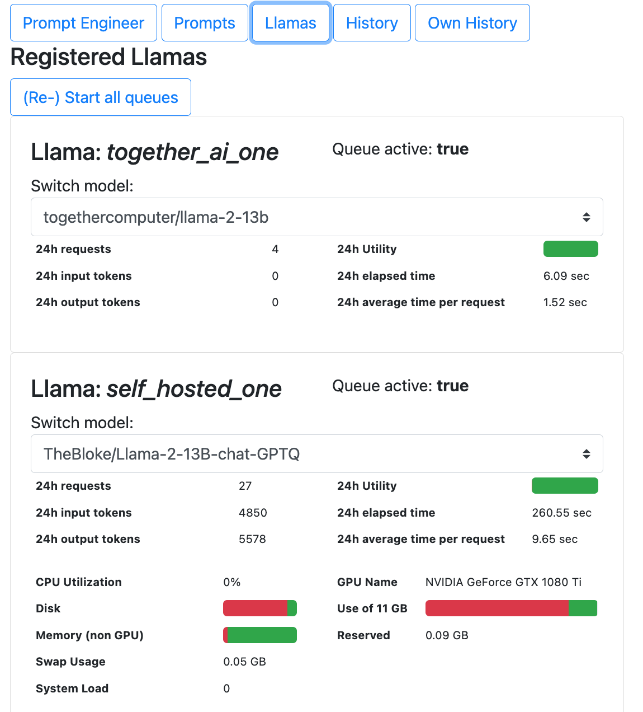

# Herding Llamas

A scalable API framework for orchestrating prompt-engineered solutions involving Large Language Models (LLMs), aiming to lower the entry hurdle for experimentation across teams while cutting time and complexity involved in launching (and integrating) a new idea.

***Recent updates***
- *[13-Aug-2023]* **Wrappers to external services** (example added: [api.together.xyz](https://api.together.xyz/)), **enhanced prompt stucture** with dynamic variables, and better prompt overview (new tab), many bug fixes.
- *[9-Aug-2023]* **Modularize [loaders](./herding_llamas/llama/loaders/)** (currently default transformers and GPTQ covered) and some cleanups.
- *[8-Aug-2023]* **Task queue** added for LLM inference. Only workers (registered Llama nodes) in the allow-list of the requestor can pick up the task.
- *[6-Aug-2023]* **Allow to set limits**. E.g., restrict access to some Llama nodes to a user group, or based on max requests / processed input/output tokens over a given time window.


# Introduction
## Vision
- Build and orchestrate your own pool of **Large Language Models** *(LLM)*
- Off-the-shelf (e.g., [hf.co](https://huggingface.co/spaces/HuggingFaceH4/open_llm_leaderboard)), fine-tuned to your needs, or externally hosted (e.g., https://api.together.xyz)
- Register and hot-swap new backend models (typially a GPU-powered computation instance running a LLM)
- **Develop and manage your repository of** model-specific **prompts** *(e.g., natural language, code understanding)* and **chains**
- Serve everything through **one central REST API** (*and hand out access tokens to users/applications*)
- **Monitor and channel utilization**
- Define **limits** per consuming app or user/role
- **Scale!**




## Motivation
With better generations of open source LLMs becoming available for personal and commercial use at the current pace, organizations and even private persons start to recognize them as an alternative or extension to products like ChatGPT and Bard. 

But it is increasingly challenging to bridge between experimentation and application. New ideas want to be tested immediately and promising candidates launched to a dedicated group of users to collect feedback, or even run A/B tests.

Developing siloed solutions for a growing portfolio of use cases will lead to missed opportunities and unnecessary cost (by re-inventing the wheel and under-utilizing resources - namely GPU time).

**Herding-Llamas** is a dynamic and versatile framework designed to serve as the core platform for innovation initiatives intending to utilize open-source LLMs. By offering a single, unified REST API for prompt engineering and integration into existing applications (or direclty serving a tailored web-app around its API), Herding-Llamas significantly reduces time and complexity involved in launching a new idea or experimenting with rapidly evolving LLM generations.

With the ability to map prompts directly to your intended audience, whether this is a specific application or user group, and hand out access tokens alongside the API entry point, Herding-Llamas makes it remarkably easy to collect feedback.

# Features

## Prompt engineering
Engineer interface to test and develop new prompts.

Your prompts are the key ingredient for herding-llamas. 

For each prompt, you can define input variables (at least one free text), and those variables are expanded in the prompt itself (e.g., `{{system_message}}`, `{{text}}`). 

The user interface reacts dynamically to the selected prompt.

Please note that for a user request throught he API, not all variables are required (nor desired). If omitted, herding-llamas will default e.g., the `system_message` to what is defined by the prompt engineer (i.e., stored to prompts.yml)

```yaml
llama_2_entity_recognition:
  name: Llama 2 entity recognition
  description: Provide a list of classes (e.g., [persons, places, food]) followed by a text. The model will return a JSON object with all found objects mapped to the respective class.
  target_models: 
    - TheBloke/Llama-2-13B-chat-GPTQ
  version: 1.0
  variables:
    - system_message: |-
        You are an intelligent and helpful expert [etc.]
    - categories: "[person, year, food]"
    - text: Hanna's favorite dish was sushi, until in 2022 she met Josephine who showed how to prepare very good falafel.
  prompt: |-
    [INST]
    <<SYS>>
    {{system_message}}
    <</SYS>>
    {{categories}}
    {{text}}
    [/INST]
  param:
    temperature: 0.1

```

As a prompt written and tested to work well with a given model (e.g., Llama-2), it may perform poorly with another model (e.g., RedPajama). Therefore you can map any prompt to a list of target models. This makes sure, that user requests to your prompt are not sent to a wrong Llama backend. 

New prompts can be published through the same API, and mapped to user groups (e.g., test / production, or teams/applications with bespoke requirements)


*Prompt engineering from the examples (incl. user feedback form)*



*Overview tab to explore prompts*



*Prompt details*

*Coming soon: **example API call** for copy/paste integration into other applications.*

## Llama nodes 
Monitor the utilization and health of all your registered Llama nodes and dynamically switch the loaded model.



*Llama overview*

## Request history
See a history of recent prompts incl. statistics (user waiting time, number of tokens processed etc.).


*Example history record from the internal database with statistics*

Users/apps can opt-out from keeping a history of their prompt content.

## Token based access
Hand out access-tokens to every user (-group) or application. The same token can be used for API requests or direclty in the web UI for experimentation / prompt engineering.

This allows you to restrict access to your resources per user group / role, and is applied on various levels of the framework:

|Access to|Description|
|---|---|
|Llamas|Steers to which [Llamas](./herding_llamas/herder/llamas.yml) (registered LLM backends) the requests from a group of users can be sent to. Typically used to protect instances from a user group running (and paying the bill for) their own backend, and expect exclusive use. |
|API Paths|Steers access to [API entry points](./herding_llamas/herder/app.py). E.g., to protect administrative activities|
|Prompts|Limits access to [prompts](./herding_llamas/herder/prompts.yml). This can be used to reduce complexity for the user groups (they only see prompts engineerd by/for them), and allows to set up a prompt lifecycle (dev/test/prod prompts only exposed to the respective group)|
|User interface|The user interface is organized in tabs. This hides admininstrative tabs to other users. Please note that this is only to simplify the user interface. Security is handled on the API level and also applies users bypass the UI.|

The access levels are defined in [roles.yml](./herding_llamas/herder/roles.yml). User tokens are assigned to such a role.

Example setting for a typical group of users who engineer their own prompts and use the API for inference.

```yaml
user_group_A:
  allow_nodes: # Decides to which Llama nodes requests from group A can be sent to.
    - self_hosted_one
    - together_ai_one
  allow_api_paths:
    - /api/v1/infer # send request
    - /api/v1/prompts # list and explore prompts
    - /api/v1/score # Score (1-5 stars) a given response
    - /api/v1/feedback # Provide verbal feedback to a given response
  allow_prompts:
    - llama_2_keep_it_short
    - llama_2_scattergories
  allow_tabs:
    - Prompts
    - OwnHistory

```


## Limit usage 

Computational backend nodes running a large langauge model ("Llamas") are typically a scarce and expensive resource. 
Unlimited (although identified) access can lead to poor response times for all due to over-use of a few. 

By design, all Llama nodes are protected from direct access. This means that even if the address of a Llama node is known, all requests sent directly (bypassing the central API) will be rejected. 

Herding-llamas keeps track of all requests, incl. statistics like input/output tokens (*"tokens" in the context of large language models refer to chunks of text that the model reads or creates*) and GPU utilization time per user, Llama node and prompt.

This allows to impose limits to individual users or applications. Limits can be applied on two metric:
- requests (count of performed inferences)
- tokens (sum of input/output tokens)

Example of a multi-level limitation, applied to one API consumer:

```yaml
limit: 
  - type: request # max 20 requests per hour
    interval: 1 # hours
    limit: 20 # count
  - type: request # max 100 requests per day
    interval: 24
    limit: 100
  - type: token # max 6000 tokens (in+out) per hour
    interval: 1 # hours
    limit: 6000 # sum of tokens

```


## API exploration
Interactive exploration, call and test your API directly from the browser


# Getting Started
*Coming soon: `pip install herding-llamas` and **Dockerfiles** for orchestrator and nodes.*
## Nodes (Llamas)
1. Clone this repository to your nodes
1. Update [conf.yml](./herding_llamas/llama/conf.yml) to your needs by adding models that should be loadable on each node. Set your custom `API_KEY` as secret between the node and the orchestrator
1. Set the token as system variable **HERDING_LLAMAS_SECRET**
1. Run `./herding_llamas/llama/startup.sh` (change the `port` if needed)
## Orchestrator (Herder)
1. Clone this repository to your orchestrator
1. Customize your prompts to [prompts.yml](./herding_llamas/herder/prompts.yml)
1. Register your nodes in [llamas.yml](./herding_llamas/herder/llamas.yml)
1. Set the token as system variable **HERDING_LLAMAS_SECRET**
1. Set the token for 3rd party hosted models as system variables (as defined in `llamas.yml`)
1. Run `./herding_llamas/herder/startup.sh` (change the `port` if needed)


# Roadmap
- [x] Add user and licensing model
  - [x] Allow-list for prompts and nodes
  - [x] Set limits per user (number of requests/tokens per hour)
- [ ] Dynamically switch models on nodes, based on observed demand
- [x] Queuing mechanism for requests
- [x] Allow to use 3rd party hosted models through API wrappers
- [ ] Allow to add modules / plugins (e.g., personal vector stores / chat with your data, reasoning, ...)

As this project is still in earl stage, the roadmap will likley be subject to frequent change.
