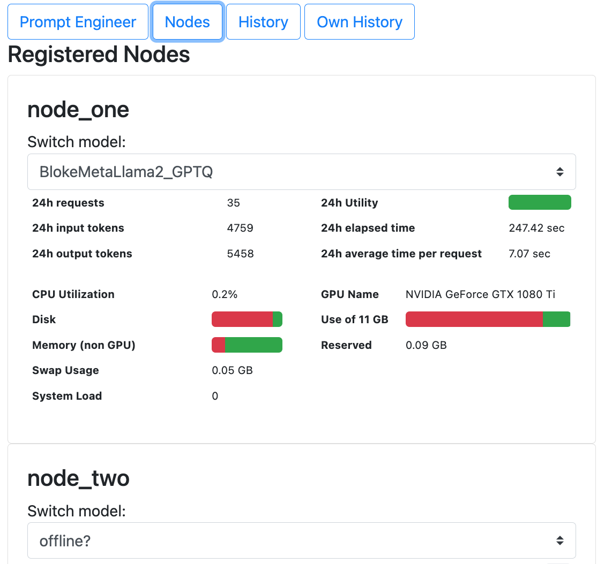
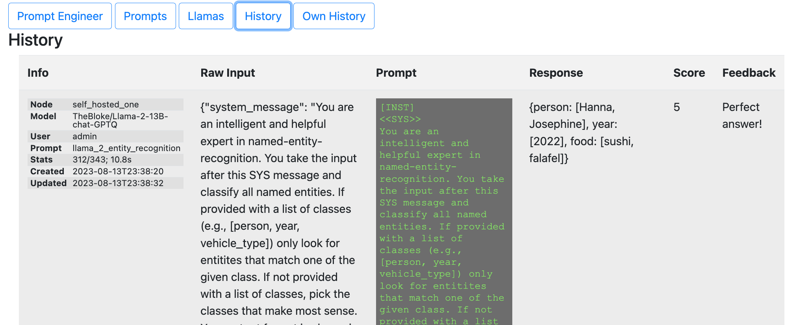

# Herding Llamas

# Introduction
## Vision
- Build your own farm of multiple **Large Language Models** *(LLM)*
- Off-the-shelf (e.g., hf.co) or fine-tuned to your needs
- **Curate a repository of** model-specific **prompts** *(e.g., natural language, code understanding)* and **chains**
- Host everything through **one single API**, with user feedback loop
- **Monitor, channel and prioritize** *(or limit)* **use**
- **Scale!**

## Motivation
With better generations of open source LLMs becoming available for personal and commercial use at the current pace, organizations and even private persons start to recognize them as an alternative or extension to products like ChatGPT. 

But it is increasingly challenging to bridge between experimentation and application, between prompt engineering and system integration. 

Developing siloed solutions will lead to lost opportunities and unnecessary cost (by re-inventing the wheel and under-utilizing resources - namely GPU time)

# Features

{width=50%}

{width=50%}

{width=75%}

# Getting Started
tbd
# Roadmap
tbd
